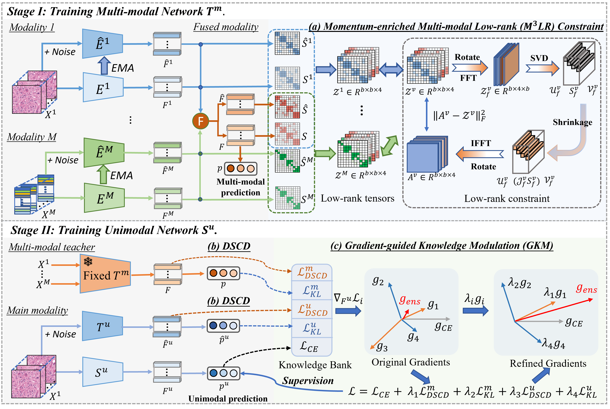

# Gradient modulated contrastive distillation of low-rank multi-modal knowledge for disease diagnosis (Medical Image Analysis 2023)

by [Xiaohan Xing](https://hathawayxxh.github.io/).

## Summary:

This repository is for our MIA 2023 paper ["Gradient modulated contrastive distillation of low-rank multi-modal knowledge for disease diagnosis"](https://www.sciencedirect.com/science/article/pii/S1361841523001342)

### Abstract:
The fusion of multi-modal data, e.g., medical images and genomic profiles, can provide complementary information and further benefit disease diagnosis. However, multi-modal disease diagnosis confronts two challenges: (1) how to produce discriminative multi-modal representations by exploiting complementary information while avoiding noisy features from different modalities. (2) how to obtain an accurate diagnosis when only a single modality is available in real clinical scenarios. To tackle these two issues, we present a two-stage disease diagnostic framework. In the first multi-modal learning stage, we propose a novel Momentum-enriched Multi-Modal Low-Rank (M
LR) constraint to explore the high-order correlations and complementary information among different modalities, thus yielding more accurate multi-modal diagnosis. In the second stage, the privileged knowledge of the multi-modal teacher is transferred to the unimodal student via our proposed Discrepancy Supervised Contrastive Distillation (DSCD) and Gradient-guided Knowledge Modulation (GKM) modules, which benefit the unimodal-based diagnosis. We have validated our approach on two tasks: (i) glioma grading based on pathology slides and genomic data, and (ii) skin lesion classification based on dermoscopy and clinical images. Experimental results on both tasks demonstrate that our proposed method consistently outperforms existing approaches in both multi-modal and unimodal diagnoses.

### Framework:


## Usage:
### Requirement:
Python 3.8

Pytorch 1.10 

CUDA 10.2

### Model training:

```
### Stage 1, multi-modal teacher training with low-rank constraint.
python3 train_cv_MT.py --pred_distill 1 --CRD_distill 0 --model_name stage1_pathomic_teacher \
    --tSVD_loss True --mode pathomic --init_type max --beta1 0.5 --fusion_type pofusion \
    --n_views 4 --tSVD_mode pathomic --Lambda_global 0.1 --batch_size 16 \
    --path_dim 128 --omic_dim 128 --mmhid 128 ;


### Stage 2, Knowledge distillation from the multi-modal teacher to the unimodal student.
python3 train_cv_path_multi_MT.py --distill crd -a 1 -b 0.02 --nce_p2 20 --num_teachers 2 \
      --CE_grads True --model_name path_weighted_4teachers_mo_0.5_thresh_0.1 --fixed_model stage1_pathomic_teacher \
      --reg_type none --beta1 0.9 --kd_T 1.0 --select_pos_mode hard --assign_weights True \
      --nce_k 1024 --nce_k2 1024 ;
```


## Citation:
```
@article{xing2023gradient,
  title={Gradient modulated contrastive distillation of low-rank multi-modal knowledge for disease diagnosis},
  author={Xing, Xiaohan and Chen, Zhen and Hou, Yuenan and Yuan, Yixuan},
  journal={Medical Image Analysis},
  pages={102874},
  year={2023},
  publisher={Elsevier}
}
```


## Acknowledgement:
The code is based on [Pathomic Fusion](https://github.com/mahmoodlab/PathomicFusion) and 
[Contrastive Knowledge Distillation (CRD)](https://github.com/HobbitLong/RepDistiller). For enquiries, please contact "hathawayxxh@gmail.com" 
