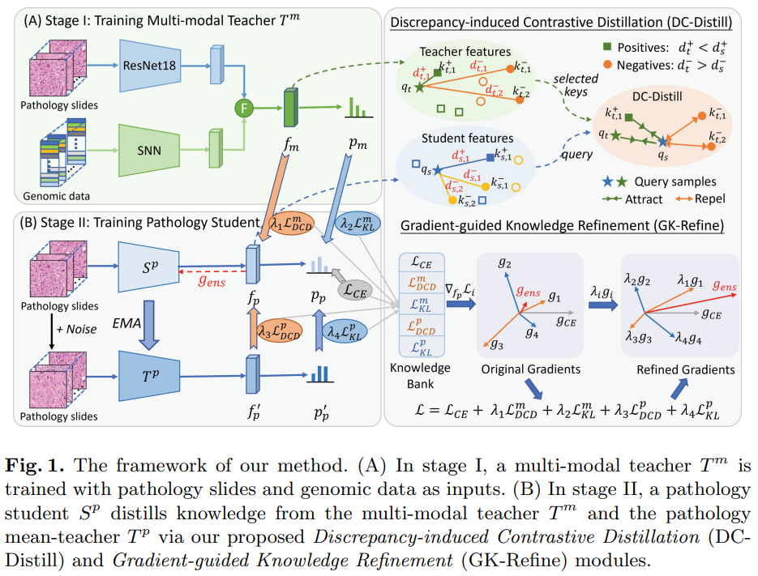

# Discrepancy and Gradient-guided Multi-modal Knowledge Distillation for Pathological Glioma Grading (MICCAI 2022)

by [Xiaohan Xing](https://hathawayxxh.github.io/).

## Summary:

This repository is for our MICCAI 2022 paper ["Discrepancy and Gradient-guided Multi-modal Knowledge Distillation for Pathological Glioma Grading"](https://link.springer.com/content/pdf/10.1007/978-3-031-16443-9_61.pdf)

### Abstract:
The fusion of multi-modal data, e.g., pathology slides and genomic data, can provide complementary information and benefit glioma grading. However, genomic profiles are difficult to obtain due to the high costs and technical challenges, thus limiting the clinical application of multi-modal approaches. In this work, we address the clinically relevant problem where paired pathology-genomic data are available during training, while only pathology slides are accessible for inference. To improve the performance of pathological grading models, we present a discrepancy and gradient-guided distillation framework to transfer the privileged knowledge from the multi-modal teacher to the pathology student. For the teacher side, to prepare useful knowledge, we propose a Discrepancy-induced Contrastive Distillation (DC-Distill) module that explores reliable contrastive samples with teacher-student discrepancy to regulate the feature distribution of the student. For the student side, as the teacher may include incorrect information, we propose a Gradient-guided Knowledge Refinement (GK-Refine) module that builds a knowledge bank and adaptively absorbs the reliable knowledge according to their agreement in the gradient space. Experiments on the TCGA GBMLGG dataset show that our proposed distillation framework improves the pathological glioma grading significantly and outperforms state-of-the-art KD paradigms. Notably, with the sole pathology slides, our method achieves comparable performance with existing multi-modal methods. 

### Framework:



## Usage:
### Requirement:
Python 3.8

Pytorch 1.10 

CUDA 10.2

### Model training:

```
### Stage 1, multi-modal teacher training.
python3 train_cv_MT.py --pred_distill 1 --CRD_distill 0 --cut_fuse_grad True \
        --model_name stage1_pathomic_teacher --beta1 0.9 ;

### Stage 2, Knowledge distillation from the multi-modal teacher to the unimodal student.
python3 train_cv_path_multi_MT.py --distill crd -a 1 -b 0.02 --nce_p2 20 --num_teachers 2 \
        --CE_grads True --model_name path_weighted_4teachers_distill --fixed_model stage1_pathomic_teacher \
        --reg_type none --beta1 0.9 --select_pos_mode mid --assign_weights True;
```


## Citation:
```
@inproceedings{xing2022discrepancy,
  title={Discrepancy and Gradient-Guided Multi-modal Knowledge Distillation for Pathological Glioma Grading},
  author={Xing, Xiaohan and Chen, Zhen and Zhu, Meilu and Hou, Yuenan and Gao, Zhifan and Yuan, Yixuan},
  booktitle={International Conference on Medical Image Computing and Computer-Assisted Intervention},
  pages={636--646},
  year={2022},
  organization={Springer}
}
```


## Acknowledgement:
The code is based on [Pathomic Fusion](https://github.com/mahmoodlab/PathomicFusion) and 
[Contrastive Knowledge Distillation (CRD)](https://github.com/HobbitLong/RepDistiller). For enquiries, please contact "xiaoxing@cityu.edu.hk" 
